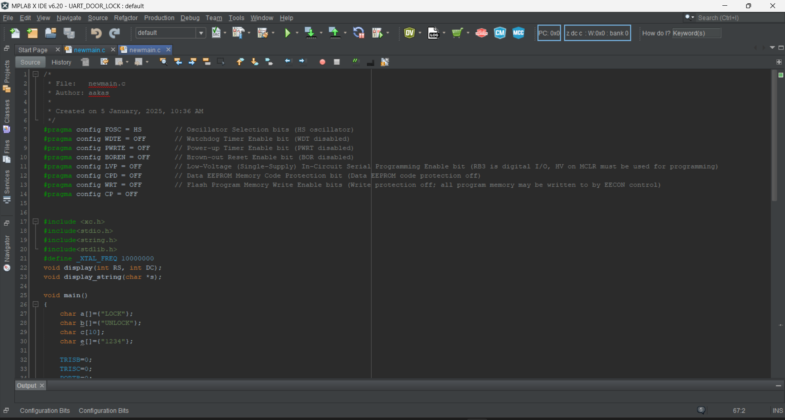
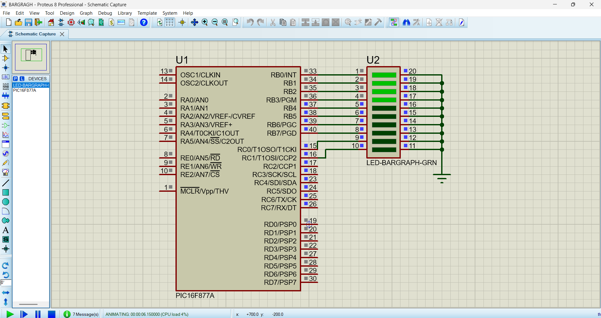
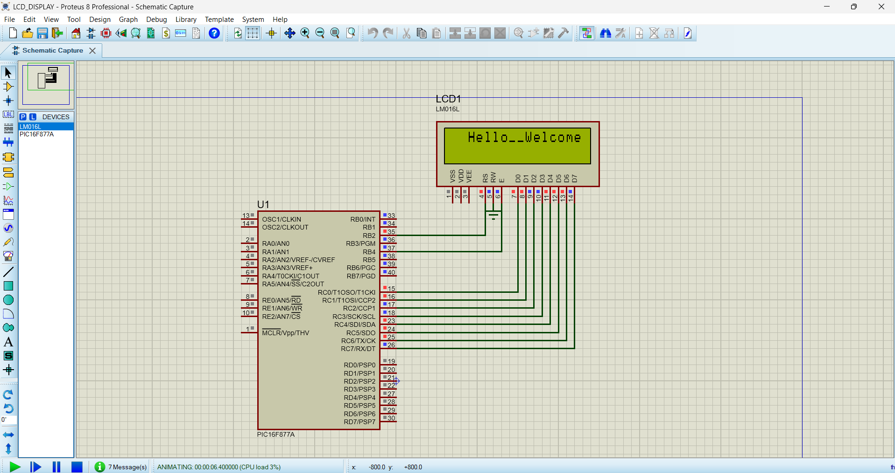

# 🔧 PIC16F877A Embedded Projects

Welcome to a collection of practical embedded system projects developed using the **PIC16F877A** 8-bit microcontroller. All code is written in **Embedded C** using **MPLAB X IDE**, and simulations are designed in **Proteus Design Suite**. These projects showcase integration of peripherals, communication protocols, and real-world applications.

---

## ⚙️ Tools Used

- **Microcontroller**: PIC16F877A
- **IDE**: MPLAB X IDE
- **Compiler**: XC8
- **Simulator**: Proteus 8 Professional

---

## 🚀 Communication Protocols

- **UART**
- **I2C**
- **SPI**

---

## 🧩 Interfaced Peripherals

- 7-Segment Display
- Matrix LED
- Servo Motors
- DC Motors
- Motor Driver (L293D)
- Buttons / Switches
- Customized Keypad
- LCD (16x2)
- ADC
- EEPROM
- Interrupts
- Temperature & Humidity Sensors

---

## 📁 Project Structure

📦 PIC16F877A-Projects ┣ 📂Wire_Cutter_Project ┃ ┣ 📜 main.c ┃ ┣ 📜 eeprom.c ┃ ┣ 📜 timer.c ┃ ┣ 📜 WireCutter.pdsprj ┣ 📂Line_Follower_Robot ┃ ┣ 📜 main.c ┃ ┣ 📜 sensors.c ┃ ┣ 📜 motor_driver.c ┃ ┣ 📜 LineFollower.pdsprj ┣ 📂UART_Communication ┣ 📂I2C_Interface ┣ 📂SPI_Interface ┣ 📂7Segment_Display ┣ 📂Matrix_LED ┣ 📂ADC_Projects ┣ 📂Interrupt_Demo ┣ 📂Servo_Motor ┣ 📂Temperature_Humidity ┣ 📂EEPROM_Storage ┣ 📜 README.md

yaml
Copy
Edit

---

## ✂️ Wire Cutter Project (with EEPROM + Timer)

This project simulates an automatic **wire cutting machine**. It allows the user to set wire length and quantity, and uses motors to feed and cut wires. It includes **EEPROM** storage to resume operation after a restart and **Timer** to control motor timing.

### 💡 Features

- Set wire length (cm) and quantity
- LCD (16x2) display for UI
- Set/Inc/Dec buttons for input
- Uses **Timer0** for motor timing
- Stores last state in EEPROM
- Resumes after power loss

### 🧠 Key Components

- `Timer0` interrupt for precise delays
- EEPROM read/write
- ADC simulated motor movement
- Buttons for manual input
- Dual motor simulation (feed + cutter)

### 📸 Design Snapshot










---

## 🤖 Line Follower Robot

A basic autonomous robot that follows a black line on a white surface using IR sensors. The project uses **digital sensors** to detect line deviation and adjusts motor direction accordingly.

### 💡 Features

- Follows black line using 2 or 3 IR sensors
- Uses **DC motors** via L293D driver
- Simple decision logic (left, right, straight)
- Fast response using polling/interrupts
- Compact Proteus simulation

### 🔧 Design Overview

- **IR Sensors**: Input to PORTB
- **Motor Driver (L293D)**: Controlled by PORTC
- **Speed control**: Optional PWM (Timer2)
- Logic:
  - Left sensor active → turn left
  - Right sensor active → turn right
  - Center only active → move straight

---

## 🔧 Timers Used

- **Timer0**: Used in Wire Cutter for motor operation delay
- **Timer2 (Optional)**: Can be used in Line Follower for PWM speed control

---

## 🧠 Concepts Demonstrated

- Embedded C using MPLAB X IDE
- Digital I/O, ADC, and EEPROM handling
- Timer and delay management
- Peripheral interfacing (Motors, Sensors, LCD)
- Logic-based control for real-time systems
- Project modularization and simulation

---

## 📌 How to Use

1. Clone this repo:
   ```bash
   git clone https://github.com/aakashdharmalingam/PIC16F877A-Projects.git
Open any .X project using MPLAB X IDE

Build project → HEX file is generated

Open respective .pdsprj in Proteus

Load the HEX to the MCU

Simulate and test!

🧑‍💻 Developed By
D. Aakash
🎓 ECE Final Year | Anna University Chennai
🔗 https://www.linkedin.com/in/aakash-d-6a1455248/
📧 aakashtommy6@gmail.com

⭐ Star this repo if you found it useful!
yaml
Copy
Edit

---

Let me know if you want:
- Actual `.c` files generated from your MPLAB project auto-documented  
- Timer logic explained for either project  
- Flowcharts or circuit diagrams  
- GIF simulations to embed in README

Happy hacking with PIC! 😎
